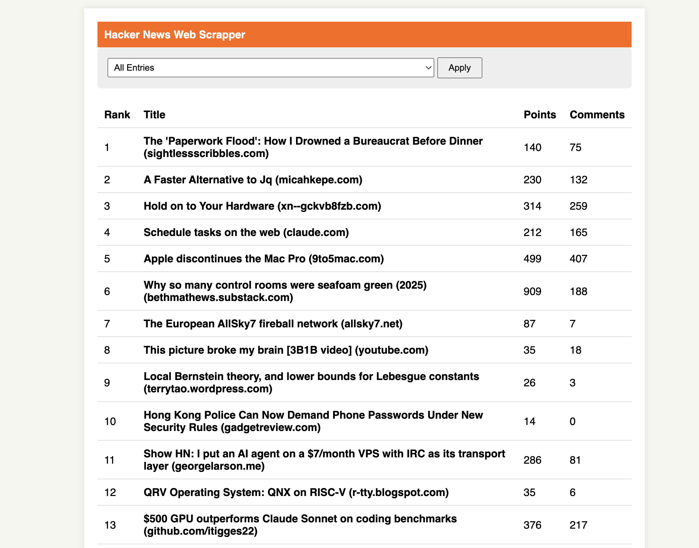

# Hacker News Web Crawler

Ruby-based web crawler for extracting and filtering the top
30 entries from [Hacker News](https://news.ycombinator.com/)
through a lightweight web interface.

## 🏗 Architectural Decisions

The project was designed using **Ports and Adapters**
oriented Architecture and **Separation of Concerns (SoC)**
principles to ensure the codebase remains readable,
maintainable, and highly testable.

- **Pure Domain:** The `Entry` entity and the `EntryFilter`
  use case are Plain Old Ruby Objects. They have no external
  dependencies.
- **Decoupled Infrastructure:** Data extraction (`Nokogiri`)
  and persistence (`SQLite3`) are isolated into adapters.
- **Framework:** **Sinatra** was chosen over Ruby on Rails
  since it is a lightweight web framework providing a fast
  and straightforward HTTP layer to interact with the
  application's core logic.
- **Performance:** The web scraper uses Nokogiri's helpers
  and Ruby integer evaluation to process the DOM. Execution
  time is measured using the system's monotonic clock
  (`Process::CLOCK_MONOTONIC`) for high precision.

## 🛠 Tech Stack

- **Ruby** (Core language)
- **Sinatra** (Lightweight web framework / Delivery adapter)
- **Nokogiri** (HTML scraping / XPath parsing)
- **SQLite3** (Frictionless persistence for usage logs)
- **RSpec** (Automated BDD testing with local fixtures)

## 🚀 Installation & Setup

The project is designed to run with minimal friction. The
database schema is automatically generated on the first run.

1. Clone this repository.
2. To run this project you will only need:
   ```bash
   ruby 3.3.6
   ```
3. Installing the project
   ```bash
   bundle install
   ```

## Running the project

1. On your terminal inside the project's root directory run:
   ```bash
   ruby app.rb
   ```
2. The previous command will start runing the project on
   [This url](http://127.0.0.1:4567). You can open this on
   your web browser, you will see a simmple user interface
   that shows you the scraping results and lets you filter
   them by title length. 

## Running tests

On your root directory just run:

```bash
   rspec --format documentation
```

## Usage Logs

### 🗄️ Database: SQLite3

**SQLite3** was chosen as the database engine to maintain
simplicity on this project.

SQLite stores the entire database in a single local file
(`usage_logs.db`), requiring zero server configuration. The
application will automatically create the schema on its
first run.

### Check logs

On the root directory you can access the SQL console by
running:

```bash
   sqlite3 usage_logs.db
```

Now you can execute any sql query, we just have one table
**usage_logs**, in wich we store our user data, you can
check the stored data with:

```sql
   SELECT * FROM usage_logs;
```
